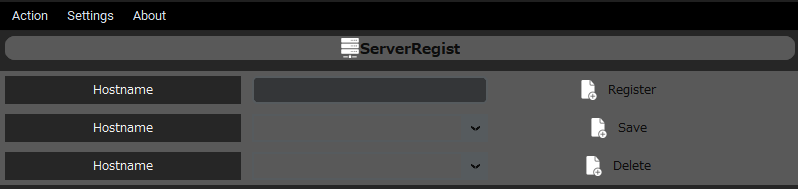
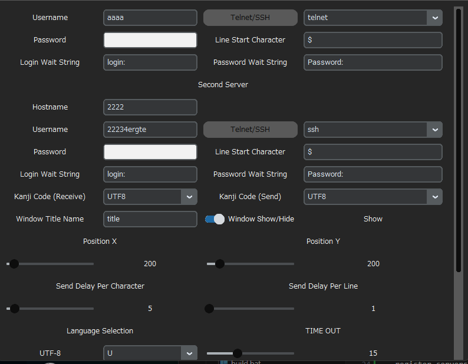
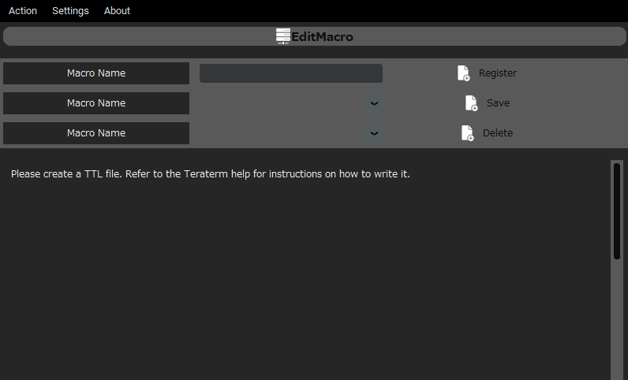
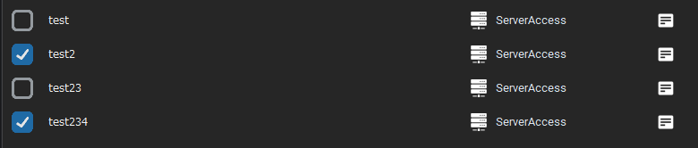

# ForTeraterm

This project provides a Python script to launch Tera Term with specified parameters. Tera Term is a terminal emulator software that supports serial port, SSH, and telnet connections.

# Version

1.0.3

| version | content                                      | detail |
| ------- | -------------------------------------------- | ------ |
| 1.0.0   | New release                                  |        |
| 1.0.2   | Minor corrections                            |        |
| 1.0.3   | Corrected behavior during screen transitions |        |

## Features

- Launch Tera Term from a Python script
- Specify connection parameters such as host or serial port

## Prerequisites

- Tera Term installed on your system

## Usage

- register servers

1. Select the [Action] > [ServerRegist]

2. Enter/select server name

3. Enter the required information or make a selection

4. "Register" for new registration, "Save" for editing
To delete settings, click "Delete"

- register maros

1. Select the [Action] > [EditMacro]

2. Enter/select server name

3. Edit macro

- launch servers

1. For individual access, click the "ServerAccess" button

2. Click on the icon below to check detailed information

3. If you want to start multiple, select the checkbox first.

4. If you also want to run a macro, check "Run Macro" and select the macro to run.

5. Click "Batch Server Access" to start the servers in order from the top.

# License

This project is licensed under the MIT License. See the LICENSE file for details.

# Contributing

Contributions are welcome! Please open an issue or submit a pull request.

# Acknowledgements

Tera Term - Terminal emulator software
